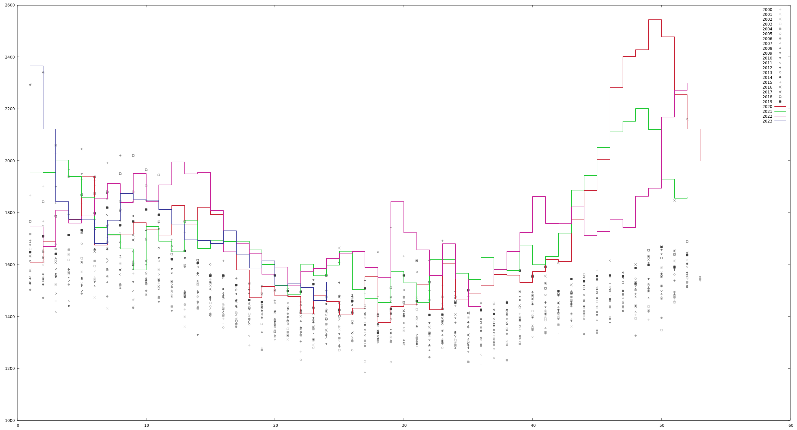

Some evaluation scripts regarding COVID
===========

* deaths.ml: each point corresponds to the deaths (y-axis) in the week (x-axis) of a particular year.
  The dots for 2020 have been coloured red and those for 2021 are coloured in red; the previous years have been marked in gray.
  The dots are connected by lines to make them more visible. There are two areas where 2020 differs from the years before:
  weeks 12-18 (March / April) and weeks 42-52 (October to December).
  
  
  
  The data does not attribute the deaths to a particular reason but the difference to other years is clearly visible.

  Data source: [Statistik Austria](https://data.statistik.gv.at/web/meta.jsp?dataset=OGD_gest_kalwo_GEST_KALWOCHE_100)
